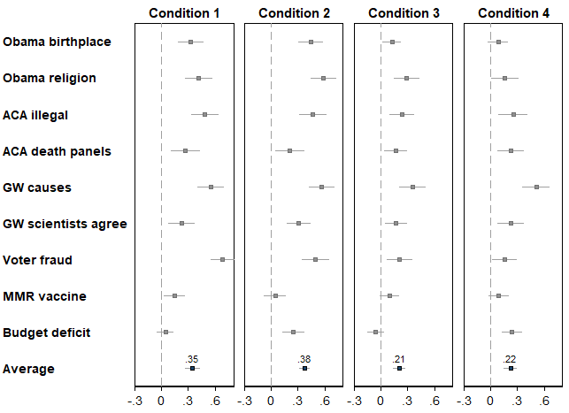

## Mind the Gap: Partisan Gaps 

This repository contains data, code, and manuscript source for the paper "_A Measurement Gap? Effect of Survey Instrument and Scoring on the Partisan Knowledge Gap_". Code for this paper is written in R and Stata (Python sparingly). The manuscript in pdf is compiled using LaTeX. The manuscript and the key results can be reproduced either by running the scripts directly or using the makefiles `make` utilities. 

<p align="center">
  
</p>

### Manuscript preparation
The Overleaf repository for the manuscript is linked its own [GitHub repository](https://github.com/LSYS/overleaf-partisan-gap) and included as a Git submodule in this repository. See  `./overleaf-partisan-gap/`. When cloning or pulling this repo, the submodule metadata (via `.gitsubmodules`) and the folder for the manuscript submodule are included. However, the actual contents of the manuscript are not included. To get the contents, `cd` into `overleaf-partisan-gap/` submodule folder, do a `git submodule init` and then `git submodule update`.

The `./Makefile` includes a recipe to update all [output](#output-of-scripts) of scripts into the `./overleaf-partisan-gap/` submodule folder. Type `make update` to do so. The `./overleaf-partisan-gap/` repository also includes a Makefile to compile the manuscript in LaTeX and clean up auxilliary files using `latexmk`. Type `make ms` from `./overleaf-partisan-gap/` to compile the [manuscript](https://github.com/LSYS/overleaf-partisan-gap/blob/main/ms/partisan_gap.pdf).

### Output of scripts
See [here](tabs/) for the tables (TeX) and [here](figs/) for the figures (pdf, png).

### Key data
* [Study 1 (MTurk sample 1)](data/turk/mturk-recoded.csv)
* [Study 2 (YouGov)](data/survey_exp/selex.csv)
* [Study 3 (Texas Lyceum)](data/tx_lyceum/Texas%20Lyceum%202012%20Data.dta)
* [Study 4 (MTurk sample 2)](data/mturk_hk/mturk_hk_relative_scoring_MC.csv)

### Scripts organization and replication
All scripts (R, Stata, Python) are in [`scripts/`](./scripts). The scripts to prepare the raw data for downstream analyses are mainly in R. See for example the [R script](scripts/02_mturk_recode.R) to output the data required for Study 1 (MTurk sample 1) analyses. See [here](#key-data) for key data files. 

The Stata scripts are in `scripts/Stata/`. Each of the four studies has its own subfolder with the relevant `do` files. But the master `do` file is always [`partisan-gaps.do`](./scripts/Stata/partisan-gaps.do). An `ado/` folder stores some of the custom Stata programs used in the scripts. The `makefile` in the `scripts/Stata/` provides a recipe to make the Stata output.

Structure of `scripts/Stata/` folder
<details open><summary><b>Collapse/expand</b></summary><p>

  ```
  .
  |-- Makefile
  |-- README.md
  |-- ado
  |   |-- rho_report.ado
  |   |-- setup.ado
  |   |-- storespecs.ado
  |   |-- tictoc.ado
  |   `-- txt2macro.ado
  |-- mturk
  |   |-- balance-tests.do
  |   |-- barplot.do
  |   |-- confidence-scoring-barplots.do
  |   |-- confidence-scoring-reg-tables.do
  |   |-- fig-partisan-gap-ips-24k.do
  |   |-- fig-partisan-gap-mc-24k.do
  |   |-- fig-partisan-gap.do
  |   |-- preamble.do
  |   `-- reg-table.do
  |-- mturk_hk
  |   |-- barplots.do
  |   |-- fig-partisan-gap.do
  |   `-- reg_table.do
  |-- partisan-gaps-log.txt
  |-- partisan-gaps.do
  |-- stata-requirements.txt
  |-- survey-exp
  |   |-- deficit-barplots.do
  |   |-- preamble.do
  |   |-- reg-table.do
  |   `-- unemp-barplots.do
  `-- tx-lyceum
      |-- preamble.do
      |-- reg-table.do
      `-- unemp-barplot.do
  ```
</p></details><p></p>

The `scripts/Stata/partisan-gaps.do` do file is the master `do` file to generate the [tables](./tabs) and [figures](./figs/). In addition to (i) reproducing the key tables and figures, the `partisan-gaps.do` master file also (ii) takes care of handling requirements using the Stata SSC packages enumerated in the [`stata-requirements.txt`](scripts/Stata/stata-requirements.txt) file and the [`setup.ado`](scripts/Stata/ado/setup.ado) file, (iii) times the runtime of the script, and (iv) log the output to the [`partisan-gaps-log.txt`](./scripts/Stata/partisan-gaps-log.txt) log file.

To `make` the Stata output, `cd` to `scripts/Stata/` and type `make all`. The path to the Stata executable is defined in the `STATA_PATH` variable in the [`makefile`](./scripts/Stata/Makefile). Change the path as required. Alternatively, run `partisan-gaps.do` from Stata to generate all output. The path to the project is defined in [`local rootdir D:/partisan-gaps`](https://github.com/soodoku/partisan-gaps/blob/6087c4bcb5feac94057bdbe6dd5f6fdffd0249f2/scripts/Stata/partisan-gaps.do#L11) in the preamble. Change this as required. Making all the Stata output should take not much longer than a couple of minutes.

Python, via Jupyter notebooks, is used only to produce the balance of covariates tests for Study 1 (MTurk sample 1) and to inspect data. These are in `scripts/py/`. The `makefile` in the path runs both notebooks and output the balance tests figures with `make all` (relies on the [`runpynb`](https://github.com/lsys/runpynb) and the [`forestplot`](https://github.com/lsys/forestplot) utilities). Making the Python output should take only a minute or so.

Total time to `make` all output should take only a few minutes.

### Software requirements
Most of the code uses [R](https://www.r-project.org/) and [Stata](https://www.stata.com/). Stata code was tested using Stata 13 and Stata 17. Python code is used sparingly from Jupyter notebooks. These can be run from the command line using the `runpynb` utility (without initiating Jupyter notebooks JupyterLab). Manuscript is compiled in `LaTeX` and from `makefiles` using `latexmk`. Some recipes are provided for convenience in the `makefiles` using [GNU Make](https://www.gnu.org/software/make/). Makefiles come with quick help by typing `make` or `make help`. 


### Authors

Lucas Shen, Gaurav Sood, and Daniel Weitzel

